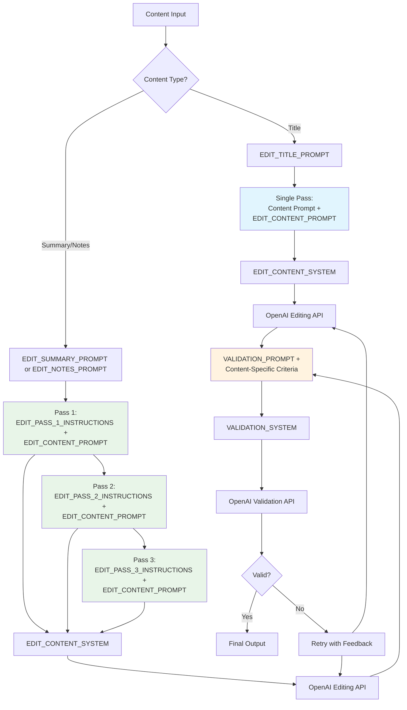

# ValidMind Release Notes Generator

This repository contains a Python script that automatically generates release notes for ValidMind's software releases. The script processes pull requests from multiple repositories and creates formatted release notes in Quarto Markdown format that is rendered as a blog-style site. 

## Overview

The release notes generator:
- Processes tags from multiple repositories
- Categorizes changes based on labels
- Compares tags, extracts commits, and finds the right PRs
- Extracts content from the PR body and PR summary
- Formats and edits titles for content for clarity and consistency
- Outputs release notes in Quarto Markdown format

## Editing & validation

The script uses LLMs to edit and validate release notes content:

- **Multi-pass editing** - Content goes through three passes:
  - Group and flatten related content
  - Remove duplicates and redundant information
  - Streamline and summarize for clarity

- **Content validation** - Each edit is validated for:
  - Maintaining original meaning and technical accuracy
  - Proper formatting and structure
  - No addition of unsupported information
  - Removal of internal sections and references

- **PR section classification** - Automatically identifies and includes:
  - User-facing changes and features
  - Breaking changes and upgrade notes
  - Screenshots and media
  - Excludes internal notes and development processes

- **Merge PR detection** - Uses LLM to identify and skip automatic merge PRs



## Requirements

- Python 3.8+
- GitHub CLI (`gh`)
- [Poetry](https://python-poetry.org/) for dependency management
- Playwright browsers (see below)

## Installation

1. Install dependencies with Poetry:

   ```bash
   cd scripts
   poetry install
   ```

2. Install Playwright browsers (required for asset downloading):

   ```bash
   poetry run playwright install
   ```

3. Set up your GitHub authentication:

   - Install and configure the GitHub CLI
   - Ensure you have appropriate permissions to access the repositories

## Usage examples

Generate release notes for `cmvm/25.06` and edit them:

```bash
poetry run python scripts/generate_release_notes.py --tag cmvm/25.06 --edit
```

Generate release notes for `cmvm/25.06` and edit them, overwriting previous files, and output DEBUG information:

```bash
poetry run python scripts/generate_release_notes.py --tag cmvm/25.06 --edit --overwrite --debug
```

## Repository Structure

- `scripts/` - Contains the main Python script and Poetry configuration
- `releases/` - Contains generated files
