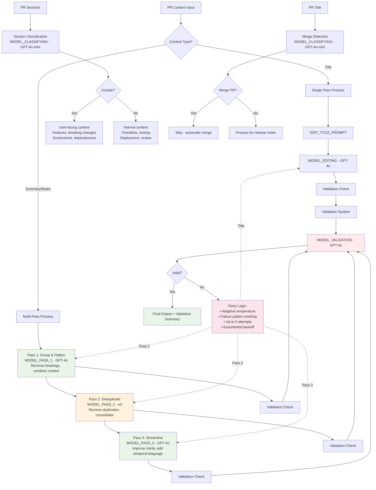

# ValidMind Release Notes Generator

This repository contains a Python script that automatically generates release notes for ValidMind's software releases. The script processes pull requests from multiple repositories and creates formatted release notes in Quarto Markdown format that is rendered as a blog-style site. 

## Overview

The release notes generator:
- Processes tags from multiple repositories
- Categorizes changes based on labels
- Compares tags, extracts commits, and finds the right PRs
- Extracts content from the PR body and PR summary
- Formats and edits titles for content for clarity and consistency
- Outputs release notes in Quarto Markdown format

## Editing & validation logic

The script uses a multi-model LLM pipeline to edit and validate release notes content with adaptive temperature management and retry logic.

### Content Processing Pipeline

**Multi-pass editing** for summaries and notes (titles use single-pass):
- **Pass 1: Group and flatten** (MODEL_PASS_1 - GPT-4o) - Removes headings, combines related content, creates cohesive blocks
- **Pass 2: Deduplicate** (MODEL_PASS_2 - o3) - Removes exact duplicates, consolidates overlapping content, varies sentence starters  
- **Pass 3: Streamline** (MODEL_PASS_3 - GPT-4o) - Improves clarity, adds temporal language, removes concluding statements

**Validation system** with adaptive retry:
- Each pass validated using MODEL_VALIDATION (GPT-4o) with content-specific criteria
- Adaptive temperature: starts at 0.2, increases 0.15 per attempt (max 0.5)
- Failure pattern tracking: format issues increase temperature, meaning issues decrease it
- Up to 5 retry attempts with exponential backoff and jitter
- Validation summaries stored in HTML comments for debugging

### Content Classification

**PR section classification** - Uses MODEL_CLASSIFYING (GPT-4o-mini) to automatically:
- Include user-facing changes, features, breaking changes, screenshots
- Exclude internal notes, checklists, deployment steps, testing sections
- Fallback to pattern matching if OpenAI classification fails

**Merge PR detection** - Uses MODEL_CLASSIFYING to identify and skip:
- Branch merges, environment syncs, deploy operations
- Release candidates and hotfix merges
- Fallback to keyword matching for 30+ merge-related terms

### Model Configuration

- **Editing models**: GPT-4o (passes 1&3), o3 (pass 2 deduplication), GPT-4o-mini (classification)
- **Temperature management**: Base 0.3, adaptive adjustments based on failure patterns
- **Token limits**: 4096 editing, 200 validation, 10 classification
- **Rate limiting**: Exponential backoff with jitter for API calls



## Requirements

- Python 3.8+
- GitHub CLI (`gh`)
- [Poetry](https://python-poetry.org/) for dependency management
- Playwright browsers (see below)

## Installation

1. Install dependencies with Poetry:

   ```bash
   cd scripts
   poetry install
   ```

2. Install Playwright browsers (required for asset downloading):

   ```bash
   poetry run playwright install
   ```

3. Set up your GitHub authentication:

   - Install and configure the GitHub CLI
   - Ensure you have appropriate permissions to access the repositories

## Usage examples

Generate release notes for `cmvm/25.06` and edit them:

```bash
poetry run python scripts/generate_release_notes.py --tag cmvm/25.06 --edit
```

Generate release notes for `cmvm/25.06` and edit them, overwriting previous files, and output DEBUG information on the command line and in output file comments:

```bash
poetry run python scripts/generate_release_notes.py --tag cmvm/25.06 --edit --overwrite --debug
```

ALPHA: Also download GitHub assets when generating and editing release notes for `cmvm/25.06`:

```bash
poetry run python scripts/generate_release_notes.py --tag cmvm/25.06 --edit --download-assets
```

Downloading assets is currently hit-and-miss due to how GitHub stores assets. There is some preliminary Playwright support in the script to enable headless downloading, but it's not very reliably at the moment, unless you authenticate manually first. 

## Repository Structure

- `scripts/` - Contains the main Python script and Poetry configuration
- `releases/` - Contains generated files
